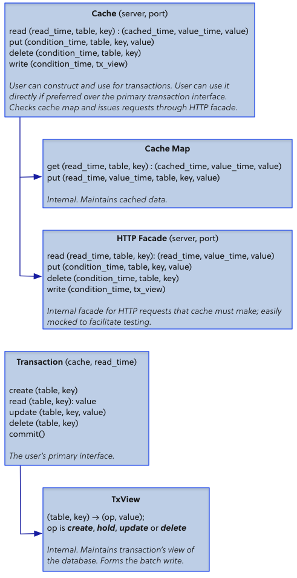
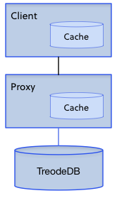
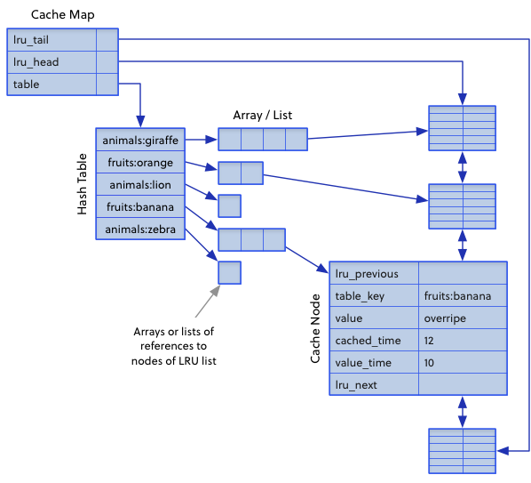
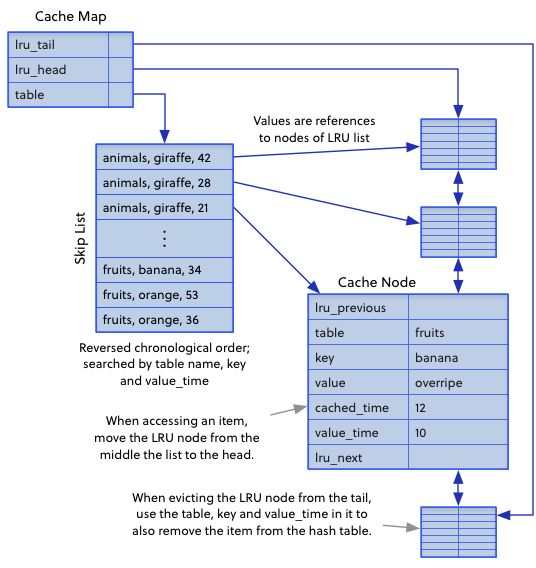

# Treode Client Library

The two major components of the Treode client library are the [Cache](#cache) and the [Transaction](#transaction).

Caches store key-value pairs retrieved from the server, as well as the associated read and value timestamps that Treode provided.  Caches also maintain a connection to the DB server.

Transactions allow users to locally perform a sequence of database operations, and then optimistically commit the result to the server by writing through the cache.

Caches and Transactions mediate between client operations and HTTP requests. They compose several other components, illustrated briefly here and explained in detail throughout this document.



## Background

**Alert**: There are multiple caches and multiple timestamps. We clarify the multiplicities here.

### HTTP Caches vs Client Caches

There are multiple caches between the user of TreodeDB and the DB itself: the client cache and HTTP caches. These two caching mechanisms interact: when the client cache sends an HTTP request, it may be handled by an intermediate HTTP cache. This document describes the behavior of the cache that is part of a TreodeDB client library, and it describes how the client cache uses HTTP directives to control the HTTP caches.



### HTTP Dates vs TxClocks

Requests and responses carry two kinds of timestamps: Date and TxClock. A Date is written per the HTTP specification, and can easily be read by a person. It has only one second resolution, which is insufficient for database transactions. A TxClock is a long (64 bits) that represents &micro;s (microseconds) since the Unix Epoch. It is written as a number to clarify that it **must not** be manipulated as a date. Applications may display TxClock values to users in a date format, but it **must** internally maintain a TxClock value as a long (64 bits) and never round it to seconds. HTTP requests and responses include both Dates and TxClocks so that both HTTP caches and TreodeDB clients can operate properly.

Both kinds of timestamps are seen in this prototypical GET request and response:

```
> GET /movie/star-wars HTTP/1.1
  Read-TxClock: 1421236153024853

< HTTP/1.1 200 Ok
  Date: Wed, 14 Jan 2015 11:49:13 GMT
  Last-Modified: Fri, 10 May 2013 02:07:43 GMT
  Read-TxClock: 1421236153024853
  Value-TxClock: 1368151663681367

  {   "title": "Star Wars",
      "cast": [
         { "actor": "Mark Hamill", "role": "Luke Skywalker" },
         { "actor": "Carrie Fisher", "role": "Princess Leia Organa" } ] }
```

### Read vs Cached vs Value Timestamps

TreodeDB and the caches keep multiple timestamps for an item: the time that the item was last written, its *value timestamp*, and the time that the item was read, its *cached timestamp*. Every entry in a cache keeps both timestamps.

Also, a request is made as of a *read timestamp*. The term *age* refers to duration between the read time of a cached value, and the read time of a request accessing that value.

Conceptually, a cache is a table such as the prototypical one here. Operationally, the client maintains the cache using a hash table or skiplist. A cached item represents an assertion that the key has that value from the value time to read time, inclusive.

<table>
<tr>
<th>Key</th>
<th>Value Time</th>
<th>Cached Time</th>
<th>Value</th>
</tr>
<tr>
<td>/movie/star-wars</td>
<td>1368151663681367</td>
<td>1421236153024853</td>
<td>JSON (primitive, array or object)</td>
</tr>
</table>

### Conditional Write Batches

The standard HTTP protocol permits updating one value per request; fortunately the HTTP specification leaves room for extensions. To implement transactions, we must have the ability to update multiple values as an atomic unit, that is all or nothing. TreodeDB supports two mechanisms for bundling updates into a batch.

- **POST to /batch-write** *(currently supported)*: The client may issue a single request to POST a batch of updates, which are contained in a JSON array.

- **Request Pipelining** *(future feature)*: The client may issue multiple POST, PUT and DELETE requests without awaiting responses. The client ties the requests together using the `Transaction` header.

### Other References

The reader may find the following references helpful.

- [Eventual Consistency and Transactions Working Together][omvcc]
- [HTTP and the Write-Write Conflict][http-write-conflict]
- [OMVCC and HTTP Caching][omvcc-caching]
- [Hypertext Transfer Protocol (HTTP/1.1): Caching][rfc7234]
- [Presentation for the SF Bay Chapter of the ACM, Mar 18 2015][presentation-2015-03-18]


# HTTP Protocol

We describe the HTTP protocol that implements reads and conditional batch write. First, we specify the standard and custom headers our HTTP messages use. Then we describe the expected forms of requests and responses between the client cache and TreodeDB server.

## Headers and Directives

### Custom Header: Read-TxClock

In an request header, this is the time to read a value as of; the value returned by the DB server will be the most recent value older than the read timestamp. In a response header, this is the time the value was read as of.

### Custom Header: Value-TxClock

In a response header, this is the time the value was written by the previous writer.

### Custom Header: Condition-TxClock

In a GET request header, this specifies that the DB should send the value only if it has been updated since the indicated time. If the value has been updated since then, the server will respond `200 OK` and include the new value. If the value has not changed since then, the server will respond `305 Not Modified`.

In a POST, PUT or DELETE request header, this specifies that the DB should apply the update only if the values have not been updated since that time. If the none of the values have changed, the server will apply the updates and respond `200 OK`. If one or more of the values has changed, the server will respond `412 Precondition Failed`.

POST, PUT and DELETE requests may be part of a write batch. POST requests to “/batch-write” will contain a write batch inside. All entries included in the write batch must be unchanged since the `Condition-TxClock` timestamp.

### Custom Header: Transaction

- Directive **id** *(currently supported)*: An arbitrary identifier represented in base64, hexadecimal, decimal or octal.

- Directive **item** *(future feature)*: An item number and total count, e.g. `2/3`.

The transaction ID must be globally unique, and the application is responsible for ensuring that.

The `id` and `item` directives support [pipelined](#pipelining) batch writes *(future feature)*.  The `id` directive represents the Transaction the message is a component of, and the `item` directive specifies the position of the message contents in the entire batch write. The directives are required for pipelining batch writes.

The header and directives are optional when issuing a POST request to `/batch-write` *(currently supported)*. The client can omit the transaction ID, and the server will choose one for it. However, the client can benefit from choosing the transaction ID itself. In this case, the client would include the header with `id` directive, but omit the `item` directive. If the client chooses an ID, and it looses its connection during a batch write, then the client can reconnect to any server in the cell and use that ID to ask for the status.

### Standard Header: Date

This is the HTTP companion to Read-TxClock. It is the time that an intermediate cache read the entry from the database. It has a resolution of only one second, so it clients must not use it for transactions. The server includes it to support intermediate HTTP caches.

### Standard Header: Last-Modified

This is the HTTP companion to Value-TxClock. It is the time that the previous writer updated the value in the database. It has a resolution of only one second, so it clients must not use it for transactions. The server includes it to support intermediate HTTP caches.

### Standard Header: If-Modified-Since

This is the HTTP companion to Condition-TxClock in a GET request. It has a resolution of only one second, so it clients must not use it for transactions. Clients do include it in requests to interoperate with intermediate HTTP caches; specifically clients round Condition-TxClock down to the second.

### Standard Header: If-Unodified-Since

This is the HTTP companion to Condition-TxClock in a POST, PUT or DELETE request. It has a resolution of only one second, so it clients must not use it for transactions. Clients do include it in requests to interoperate with intermediate HTTP caches; specifically clients round Condition-TxClock down to the second.

### Standard Header: Cache-Control

- Directive **max-age**: The max number of seconds between now and an entry’s cached timestamp.

  The directive indicates that the user will accept a value from an intermediate cache if that value was read from the DB server fewer than `max-age` seconds ago. An intermediate HTTP cache computes the age as the duration between the request’s time and the entry’s Date header. The max-age directive controls intermediate caches only; the DB ignores it. The DB server gives back the most recent value w.r.t. the read timestamp, regardless of the `max-age` requirement.

- Directive **no-cache**: Forces the cache to send a request to the DB server to retrieve the requested value.

The `Cache-Control` header is optional. If a client does include the header, it will use only one of the `max-age` or `no-cache` directives.

An example of usage is below:

    GET /[table_id_string]/[key_string] HTTP/1.1
    Cache-Control: max-age=300

## Requests

We give examples of HTTP requests below.

### Read Requests

The request to the DB includes the table name, the desired key, and headers restricting the timestamps of the value.

HTTP read requests should follow this format:

    GET /[table]/[key] HTTP/1.1
    If-Modified-Since: [http date]
    Cache-Control: max-age=[duration, seconds]
    Read-TxClock: [timestamp, microseconds, 64 bits]
    Condition-TxClock: [timestamp, microseconds, 64 bits]

The `If-Modified-Since `, `Cache-Control`, `Read-TxClock` and `Condition-TxClock` headers are all optional. Here is an example of an HTTP read request:

    GET /movie/star-wars HTTP/1.1
    If-Modified-Since: Fri, 10 May 2013 02:07:43 GMT
    Cache-Control: max-age=300
    Read-TxClock: 1421236153024853
    Condition-TxClock: 1368151663681367

The client is requesting the value of key "star-wars" in the table "movie".  Since this key's value may have changed over time, the client gives a time range for the value, and tolerances for the age of items from intermediate HTTP caches. Specifically, the client wants a value that was written on or before time 1421236153024853 &micro;s. The client already has a value that was written on 1338735183450735 &micro;s, so it only needs a new value if it was written since then.

The client will accept a value from an intermediate cache, only if that cache has read the DB less than 300 seconds before the request. Otherwise, the client wants the value directly from the DB server. Finally, the client could have used  the `no-cache` directive to force the cache to forward the request to the DB server, even if the cache already has a value satisfying the other requirements.

### Write Requests

#### PUT or DELETE a Single Row

The client message to the DB includes the table name and operation to perform on the table.

The HTTP request for write should be similar to the following:

    PUT /[table]/[key] HTTP/1.1
    If-Unmodified-Since: [http date]
    Transaction: id=[identifier, globally unique]
    Condition-TxClock: [timestamp, microseconds, 64 bits]

    [JSON]

The `If-Unmodified-Since` and `Transaction`, `Condition-TxClock` headers are optional. If included, the `Transaction` header needs only the `id` directive. The `item` directive is necessary only for pipelined batch writes.

Here is an example of the HTTP write request of one item:

    PUT /movie/star-wars HTTP/1.1
    If-Unmodified-Since: Fri, 10 May 2013 02:07:43 GMT
    Condition-TxClock: 1368151663681367

    {   "title": "Star Wars",
        "cast": [
            { "actor": "Mark Hamill", "role": "Luke Skywalker" },
            { "actor": "Carrie Fisher", "role": "Princess Leia Organa" },
            { "actor": "Harrison Ford", "role": "Han Solo" } ]
    }

TreodeDB writes the given JSON content to key "star-wars" in table "movie", provided that the current value associated with the "star-wars" key has remained unchanged since the time 1368151663681367 &micro;s.

In addition, the DB server supports batch writes. The client may use the above format for writing individual items. When writing multiple items as an atomic unit, and the cache will use batch writes instead of the above. There are several batch write formats the DB server accepts:

#### POST /batch-write, JSON Array

The items of the batch may be wrapped into a JSON array and POSTed to `/batch-write`.

    POST /batch-write HTTP/1.1
    If-Unmodified-Since: [http date]
    Transaction: id=[identifier, globally unique]
    Condition-TxClock: [timestamp, microseconds, 64 bits]

    [ { "op": [op1], "table": [table1], "key": [key1], value: [json1] },
      { "op": [op2], "table": [table2], "key": [key1], value: [json2] },
      … ]

The `If-Unmodified-Since` and `Transaction`, `Condition-TxClock` headers are optional. If included, the `Transaction` header needs only the `id` directive. The `item` directive is necessary only for pipelined batch writes.

TreodeDB writes the given JSON contents (primitives, arrays or objects) to their respective keys in their respective tables, provided that the current values for all of those rows has remained unchanged since the condition time.

The operations may be `create`, `hold` and `update`, `delete`. Only the `create` and `update` operations require a value; the `hold` and `delete` operations may omit the value.

<a name="pipelining"></a>
#### Request Pipelining (Future Feature)

The client may send each item in the batch write as a separate HTTP request. The client sends the requests one after the other without awaiting responses; then itwaits for all the responses after sending the last request of the batch. The client uses the `item` directive to indicate that the requests are part of a batch write. For example,

    PUT /movie/star-wars HTTP/1.1
    If-Unmodified-Since: Fri, 10 May 2013 02:07:43 GMT
    Transaction: id=0x48F67CEFC11894639F3B8853BB247F01C1865406B3548DD2, item=1/2
    Condition-TxClock: 1368151663681367

    { /* movie object */ }

    DELETE /movie/stars-war HTTP/1.1
    If-Unmodified-Since: Fri, 10 May 2013 02:07:43 GMT
    Transaction: id=0x48F67CEFC11894639F3B8853BB247F01C1865406B3548DD2, item=2/2
    Condition-TxClock: 1368151663681367

Unlike the batch write method that posts a JSON array to `/batch-write`, this pipelining method allows intermediate HTTP caches to see that they should invalidate their cached values.

## Responses

As with the Requests section, please see more information in [OMVCC and Caching](https://forum.treode.com/t/omvcc-and-http-caching/62).

### Read Response

The DB will respond to read requests with a message containing the desired value or an indication the value does not exist in the table.

When the item is in the database, the HTTP response will resemble the following:

    HTTP/1.1 200 Ok
    Date: Wed, 14 Jan 2015 11:49:13 GMT
    Last-Modified: Fri, 10 May 2013 02:07:43 GMT
    Read-TxClock: 1421236153024853
    Value-TxClock: 1368151663681367
    Vary: Read-TxClock

    {   "title": "Star Wars",
        "cast": [
            { "actor": "Mark Hamill", "role": "Luke Skywalker" },
            { "actor": "Carrie Fisher", "role": "Princess Leia Organa" } ] }

There are several cases in which the HTTP response does not include the JSON value:

- **HTTP/1.1 304 Not Modified**: The item has not changed since the time indicated by the `Condition-TxClock` header. This status can occur only if the request includes that header.

  This response is still valuable to the cache, as it allows the cache to update the cached timestamp for this entry to the read timestamp of this request&mdash;the client has just learned that the value has not changed between when the value was last read and this read.

- **HTTP/1.1 404 Not Found**: The requested value is not in the table.

  This response is also valuable to the cache, as the it can store that the key had no value as of that read time. In Python for example, we may store None instead of JSON. Then future requests can see that without going to the DB server.

### Write Responses

The DB will respond with either a success or rejection indicator. The HTTP response for a successful PUT or DELETE to an individual item, or a POST to `/batch-write` will look like:

    HTTP/1.1 200 Ok
    Value-TxClock: 1421236393816753

However, it is possible the DB server will reject the write because another client has written some of the values in the meantime.  In this case, the HTTP write response will be:

    HTTP/1.1 412 Precondition Failed
    Value-TxClock: 1421236393816753

The `Value-TxClock` included in the response is the maximum of the timestamps on the rows identified in the write batch. The write should throw a StaleException, and the the client should retry the operation with a smaller value for the max-age header (e.g., min-age=0) to ensure the values it receives from the client cache and intermediate caches are not stale.

Also, it is possible the DB server will reject the write because it attempts to create rows which already exist. The HTTP response will be:

    HTTP/1.1 409 Conflict

In this case the write should throw a CollisionException, and the client should retry the operation using different keys for the new rows.

When the client pipelines requests (future feature), the server provides the response multiple times, once for each request.


<a name="cache"></a>
# Cache

We provide an overview of the Cache class, including its internal data structure, and its public methods.

- Constructor Parameters:
    1. server: required string, e.g. “www.example.com”
    2. port: int, default 80
    3. max\_age: int, default None
    4. no\_cache: bool, default False

- Public Methods:
    1. read (read\_time: TxClock, table: String, key: String, max\_age: int, no\_cache: bool): JSON value
    2. put (condition\_time: TxClock, table: String, key: String, value: JSON): TxClock<br>&nbsp;&nbsp;&nbsp;&nbsp;throws StaleException
    3. delete (condition\_time: TxClock, table: String, key: String, value: JSON): TxClock<br>&nbsp;&nbsp;&nbsp;&nbsp;throws StaleException
    4. write (condition\_time: TxClock, op\_list: TxView): TxClock<br>&nbsp;&nbsp;&nbsp;&nbsp;throws StaleException, CollisionException

- Internal Objects:
    1. HTTP connection to server
    2. Map for maintaining the cache

- Exceptions:
    1. StaleException (condition\_time: TxClock, value\_time: TxClock)
    2. CollisionException

## Cache Structure

The cache internally maintains a connection to the DB server, and a map of cache entries.

### Database Connection

The cache should use an HTTP Request/Response library to establish a connection with the DB server and read and write values. For example, we may use [urllib3](https://urllib3.readthedocs.org/en/latest/) in Python.

### Map of Cache Entries

We propose two possible designs for implementing the cache; the preferable of the two designs depends largely on the existing libraries available in the client language. The cache performs two operations on this map:

    type TxClock (time: Long)

    type CacheResult (value_time: TxClock, cached_time: TxClock, value: JSON)

    get (read_time: TxClock, table: String, key: String): CacheResult
    put (read_time: TxClock, value_time: TxClock, table: String, key: string, value: JSON)

#### Hash Table of Arrays



The cache may be a doubly-linked list of entries, plus a hash table of arrays (or lists) of those entries.

In Python, the hashtable is a standard Python dictionary. The `table:key` keys are composed by concatenating the table name and key.  Each `table:key` maps to an array of references to nodes in the LRU list. Each node of the LRU list contains the table, key, value, its timestamps and the LRU’s previous and next pointers. The value may be None to indicate that there is no value for duration.

To `get` an item as of a given `read_time`, we lookup the array for `table:key`, and then we search that list for the *most recent* `value_time` on or before the given `read_time`. We return the tuple `(value_time, cached_time, JSON value)`

To `put` an item with a given `value_time`, we lookup the array for `table:key`, search that array for a tuple with the *same* `value_time`. If we find one, we set the `cached_time` of that tuple to the greater of the given `read_time` or the `cached_time` already recorded in the tuple. If we do not find an entry with the *same* `value_time`, we add a new tuple and we may need to remove the least recently used tuple in the cache.

If the arrays (or lists) are unsorted, then `add` is *O*(1), and `find` (floor), `replace`, and `remove` are each *O*(n).  If the lists are sorted, then all the operations are *O*(n). We expect the most frequent operations to be `find`, `replace` and `remove`; sorting would not improve the asymptotic runtimes of these operations. Furthermore, we expect the lists to be small, so the effort of sorting would be moot.

#### Skiplist



If a skiplist that supports floor and ceiling operations is available, then the cache can be implemented using it. Each `(table, key, reverse_time)` maps to a node in the LRU list. Each node of the LRU list contains the table, key, value, its timestamps and the LRU’s previous and next pointers. The skiplist is effectively sorted in reverse chronological order. The value may be None to indicate that there is no value for duration.

To `get` an item as of a given `read_time`, we lookup the *ceiling* entry for `(table, key, (Long.Max - read_time))`, and then we return the tuple `(value_time, cached_time, JSON value)`.

To `put` an item with a given `value_time`, we lookup the *exact* `(table, key, (Long.Max - value_time))`. If we find one, we set the `cached_time` of that tuple to the greater of the given `read_time` or the `cached_time` already recorded in the tuple. If we do not find an exact match, we add a new tuple, and we may need to remove the least recently used tuple in the cache.

All operations should be *O* (*n* lg *n*).

## Cache Methods

### read

    read (
        read_time: TxClock,
        table: string,
        key: string,
        max_age: int (seconds, default None),
        no_cache: bool (default False)
    ): JSON value

The read method first checks the cache.  If the entry is missing, or if it has been too long since we read that entry, it sends a read request to the DB for the given table and key, along with the specified cache parameters. Whether TreodeDB provides `200 Ok` and a value or `404 Not Found`, we update our cache to record the value and duration.

The max\_age, and no\_cache parameters can be specified by the user in four separate locations: (1) in the cache constructor, (2) in the cache read method, (3) in the transaction constructor, and (4)in the transaction read method.  The cache read method determines the most restrictive set of parameters based on these three inputs and sends this most restrictive parameter set to the DB. The most restrictive parameter set is:

- **max\_age**: the minimum of all given max\_age values.

- **no\_cache**: the disjunction (boolean "or") of all given no\_cache values.

These max\_age and no\_cache values also appear in cache read method, though users do not directly provide those values. Users provide max\_age and no\_cache to the transaction constructor and transaction read method, and then the transaction read method in turn provides restricted values to the cache read method.

### put

    put (
        condition_time: TxClock, 
        table: String,
        value: JSON
    ): TxClock
        throws StaleException

The put method sends the value to the DB server as a conditional PUT. If the server accepts the PUT, the put method also updates the cache to reflect the newly written value. Otherwise, the put method throws a stale exception, including the value timestamp from the rejection.

This method exists for a client that wishes to skip the Transaction abstraction and PUT directly to the database.

### delete

    delete (
        condition_time: TxClock, 
        table: String
    ): TxClock
        throws StaleException

The delete method sends the request to the DB server as a conditional DELETE. If the server accepts the DELETE, the delete method also updates the cache to reflect the newly removed value. Otherwise, the delete method throws a stale exception, including the value timestamp from the rejection.

This method exists for a client that wishes to skip the Transaction abstraction and DELETE directly on the database.

### write

    write (
        condition_time: TxClock,
        tx_view: (table, key) -> (op, value)
    ): TxClock
        throws StaleException, CollisionException

The write method sends the [transaction’s view](#tx-view) to the DB server as a conditional batch write. If the server accepts the batch write, the write method also updates the cache to reflect the newly written values. Otherwise, the write method throws a stale exception or a collision exception as appropriate.

This method exists to support the commit method in the Transaction abstraction.


<a name="transaction"></a>
# Transaction

- Constructor Parameters:

    1. cache: Cache
    2. read\_timestamp: TxClock, default now
    3. max\_age: int, default None
    4. no\_cache: bool, default False

- Public Methods:

    1. create (table: String, key: String, value: JSON)<br>&nbsp;&nbsp;&nbsp;&nbsp;throws CollisionException
    1. read (table: string, key: string, max\_age=None, no\_cache=False): JSON<br>&nbsp;&nbsp;&nbsp;&nbsp;throws StaleException
    2. update (table: string, key: string, value: JSON)
    3. delete (table: string, key: string)
    4. commit(): TxClock<br>&nbsp;&nbsp;&nbsp;&nbsp;throws StaleException, CollisionException

- Internal Objects:

    1. min\_rt: TxClock = TxClock.MaxValue

       The minimum read time the transaction has seen so far, based on values read.

    2. max\_vt: TxClock = TxClock.MinValue

       The maximum value time the transaction has seen so far, based on values read.

    3. view: Map of `(table, key) -> (op, value)`

        All the operations performed by the user during the transaction.

- Exceptions:

    1. StaleException (condition\_time: int, value\_time: int)
    2. CollisionException

## Transaction Structure

First, we must understand the purpose of the transaction's min\_rt and max\_vt. A transaction comprises updated database entries, and the client prefers to derive an update from a consistent snapshot of the database values. Specifically, a snapshot is consistent if max\_vt < min\_rt (see [this explanation][omvcc]).

The transaction uses min\_rt and max\_rt to check this invariant on each read. If a new read causes the invariant to be violated, that is if it retrieves a value that was written after some earlier value was read, then read will throw a StaleException immediately, so that the client can stop this work immediately, and retry its operation with fresher data.

<a name="tx-minrt"></a>
### min\_rt

The transaction maintains the minimum cached time it has seen so far.  On every read from the cache, if the cached time is less than min\_rt, we update min\_rt. The cached time is the most recent time that we verified the entry as current in the database. It depends on when we most recently read the value from the source database and placed it into the cache.

### max\_vt

The transaction maintains the maximum value time it has seen so far. On every read from the cache, if the value time is greater than max\_vt, we update max\_vt. Updating max\_vt can violate the invariant described above, causing the transaction read method to throw a StaleException. However, updating min\_rt need never violate the invariant, because we can ensure that the cached time is greater than our max\_vt by adjusting the max-age HTTP directive. When issuing a read, we compute the max\_age for that read as the minimum of:

 - the max\_age from the transaction constructor
 - the max\_age from the parameter to the read method
 - the read\_timestamp from the transaction constructor - max_vt

Since the max\_age is at most `read_timestamp - max_vt` for all values read so far, we ensure that the cached time of the resulting read will be on or after max\_vt.


<a name="tx-view"></a>
### view

The view maintains the map of operations performed throughout the transaction.  This map has type `(table, key) -> (op, value)`.  When the user commits the transaction, the view is handed to the cache, which writes the changes through to the DB server via batch write. If the view's entries are out-of-date with the DB, write will throw a StaleException.

Every value read from the cache during the transaction is stored in this map, including values that do not change within the transaction; those are stored in the view with the *hold* operation, as we explain below.

Unlike the cache, the transaction does not maintain a history of values.  Rather, it stores the user's working state.

The possible ops in the map are the following

- **create**

  Add a new entry to the DB with *key* and *value*, if an entry for *key* does not already exist, or if the current entry for *key* is *delete*.

- **hold**

  Maintain the current value in the DB. The *hold* operation allows us introduce read dependencies.

  The hold operation exists because the transaction’s computation depends on any value that it read from cache during the operation.  Therefore, the success of the transaction depends on these values having NOT changed in the DB since it read them.  If these value have changed, the transaction is stale and should receive a StaleException.

- **update**

  Set the existing entry, or add a new entry, for the *key* and *value*.

- **delete**

  Remove the *key* from the database.  The *delete* operation does not require a value.
  
Create and update differ slightly in their semantics. Create sets the key to the value if the row does not exist, or if the latest write to the row was a delete, regardless of the timestamp on the delete. Update on the other hand, sets the key to the value if the latest write to the row satisfies the condition time, regardless of whether the row existence (a non-existent row is implicitly a delete at time 0).

## Transaction Methods

### create

    create (table: string, key: string, value: JSON)
        throws CollisionException

Create adds a new entry to the view, or changes the existing entry. When adding a new entry, it sets the operation to *create*, and sets the new value. If an entry already exists in the view, and its operation is not *delete*, then create throws a collision exception.  When changing an existing entry that currently has *delete* as its operation, create changes the value, and it changes the operation to *update*.

Like update and delete, create never immediately fails, because a write is only reflected in the view until the transaction commits.

### read

    read (
        table: string,
        key: string,
        max_age: int (default None),
        no_cache: bool (default False)
    ): JSON
        throws StaleException

The read method first attempts to read the specified key from the view, then from cache, and finally from the DB server.  If read finds the requested value, it stores it in the view; otherwise, it also stores if the key had no value (None in Python) for that read\_time.

If read finds a value time greater than any previous read time (value\_time > min\_rt), then it throws StaleException (read\_time, max\_vt).

Unlike the cache read method, all transaction reads use the same read\_time, which is specified in the constructor.

### update

    update (table: string, key: string, value: JSON)

Update adds a new entry to the view, or changes the existing entry. When adding a new entry, it sets the operation to *update*, and sets the new value. When changing an existing entry, update changes the value, and it may change the operation. If the existing operation is *create* or *update*, then update does not change the operation. If the existing operation is *hold* or *delete*, then update changes the operation to *update*.

Like create and delete, update never immediately fails, because a write is only reflected in the view until the transaction commits.

### delete

    delete (table: string, key: string)

Delete adds a new entry to the view, or updates the existing entry. In either case, it sets the operation to *delete* and the value to None.

Like create and update, delete never immediately fails, because a write is only reflected in the view until the transaction commits.

### commit

    commit()
        throws StaleException, CollisionException

Commit passes the map to the cache’s write method, which iterates through the map entries and constructs a batch write, and then sends the batch write to the DB server.


[http-write-conflict]: https://forum.treode.com/t/http-and-the-write-write-conflict/51 "HTTP and the Write-Write Conflict"

[omvcc]: https://forum.treode.com/t/eventual-consistency-and-transactions-working-together/36 "Eventual Consistency and Transactions Working Together"

[omvcc-caching]: https://forum.treode.com/t/omvcc-and-http-caching/62 "OMVCC and HTTP Caching"

[presentation-2015-03-18]: http://goo.gl/le0rjT "Presentation at for the SF Bay Chapter of the ACM, Mar 18 2015"

[rfc7234]: http://tools.ietf.org/html/rfc7234 "Hypertext Transfer Protocol (HTTP/1.1): Caching"

[rfc7234-5.2.1]: http://tools.ietf.org/html/rfc7234#section-5.2.1 "Request Cache-Control Directives"
